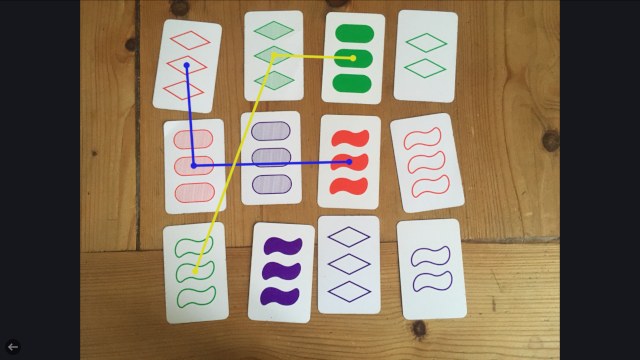

#Set Card Detection

Get some help with playing the card game [SET®](https://en.wikipedia.org/wiki/Set_(card_game).
Take and upload a picture of SET cards to the website and all possible sets in it will be displayed:

https://gorgeousone.github.io/Set-Card-Detection-js

##Idea

With the help of the edge detection algorithms of [OpenCV](https://opencv.org/) js the program can:
* Find all individual shapes in the image with their color and shading
* Group all the shapes together which are on the same card
* Find all card triples that meet the requirements for a set and display them

##Boring Details

Detecting the single shapes happens in multiple steps.  
The first major step in the code is to use OpenCV's edge detection algorithm to find the contours of shapes in the image.  
For that the image is being blurred and converted to grayscale.

*image*

To identify the contours of the set shapes only I came up with some requirements:
* A contour should not be too small or too big relative to the size of the image

OpenCV provides methods to find the smallest rectangle fitting around a contour.
* The sides lengths of this rectangle hate to be in a certain proportion to each other.  
*image*
* The area of a contour should fill its rectangle up to a certain proportion.  
Funnily this rule also seems to be quiet suitable to determine the kind of shape:
*image*

Next on the list is determining color and shading of each shape.  
To be able to tell apart the border area of a shape and it's shading inside I created a function to expand or
shrink a contour.  
So with more methods of OpenCV to create masks from contours I was able to filter out the mean color of a shape and it's shading.  
*image*  
Based on the hue of the border the shape color is determined and and with the difference in brightness between border and inside the type of shading.

In order to find out which shapes belong together on a card the distance between the center of each shape is being checked.  
All shapes of the same type within a small radius of each other are combined to one card:  
*img*

With the complete information about all cards a simple algorithm checks for sets:  
A set consists of three cards where each of the four features on its own - color, number, shape, and shading - is displayed all same or all different on the cards.